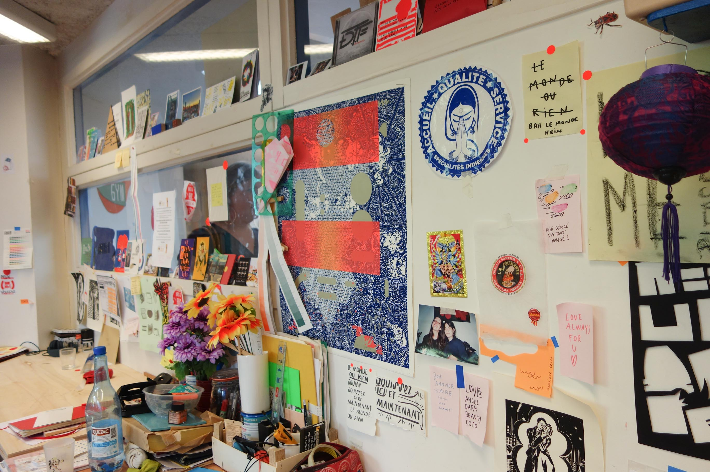
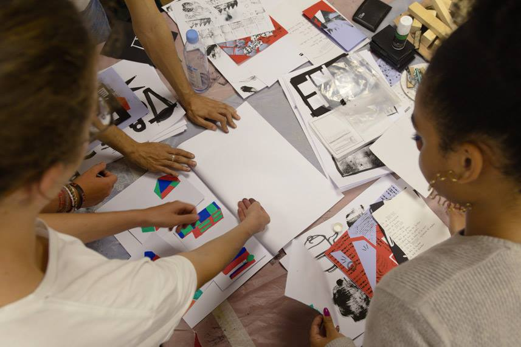
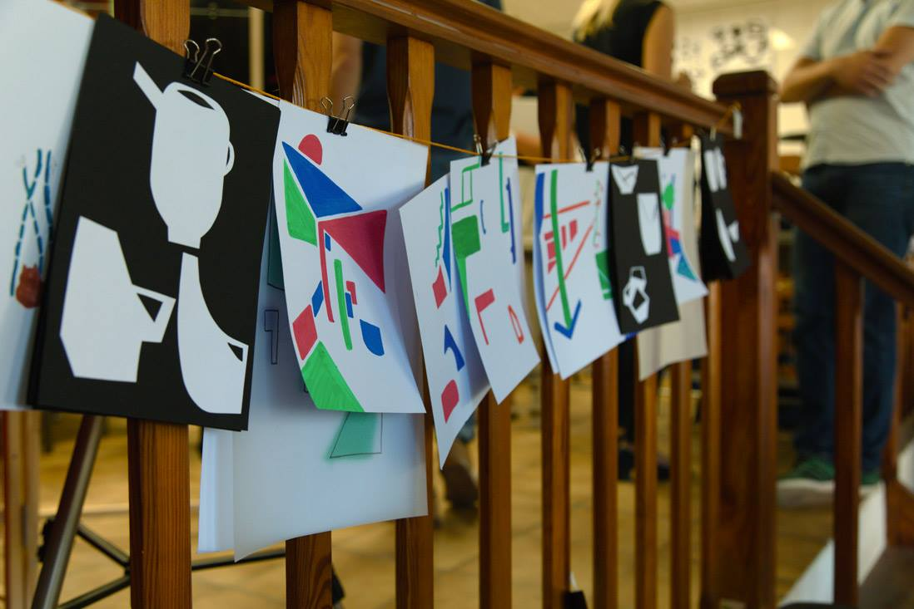
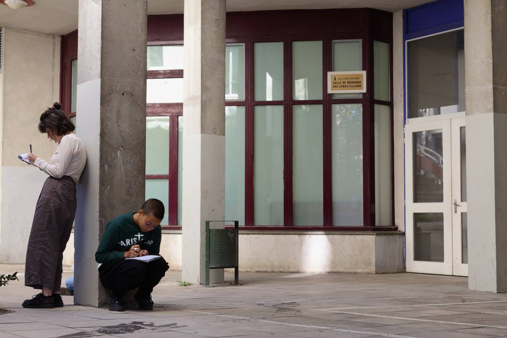
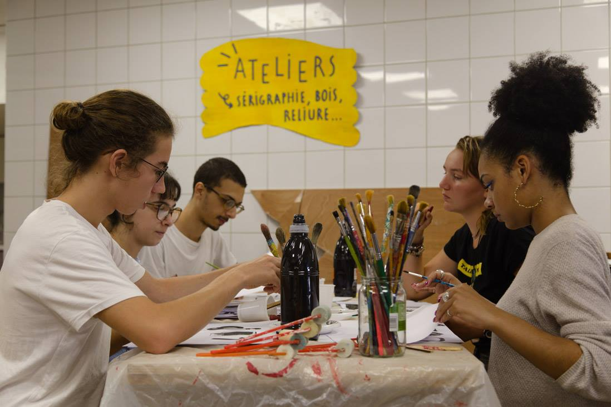

export const frontmatter = {
    title: 'La cité des Longs Sillons',
    date: '2018-10-05T22:55:56.925Z',
    client: 'Ne Rougissez Pas x LTAA Auguste Renoir',
    service: 'Workshop',
    cover: './workshop3.jpg',
}

Le collectif NRP rassemble graphiste, plasticien, cinéaste, sérigraphe, illustrateur autour du rêve comme moteur de fabrication collective.

## La tracterie

 

### Workshop: Semaine 1

Premières recherches graphiques avec trois classes d'étudiants en céramique du lycée Renoir, pour la création d'un service à café et thé pour La Tracterie, notre café/atelier associatif.

