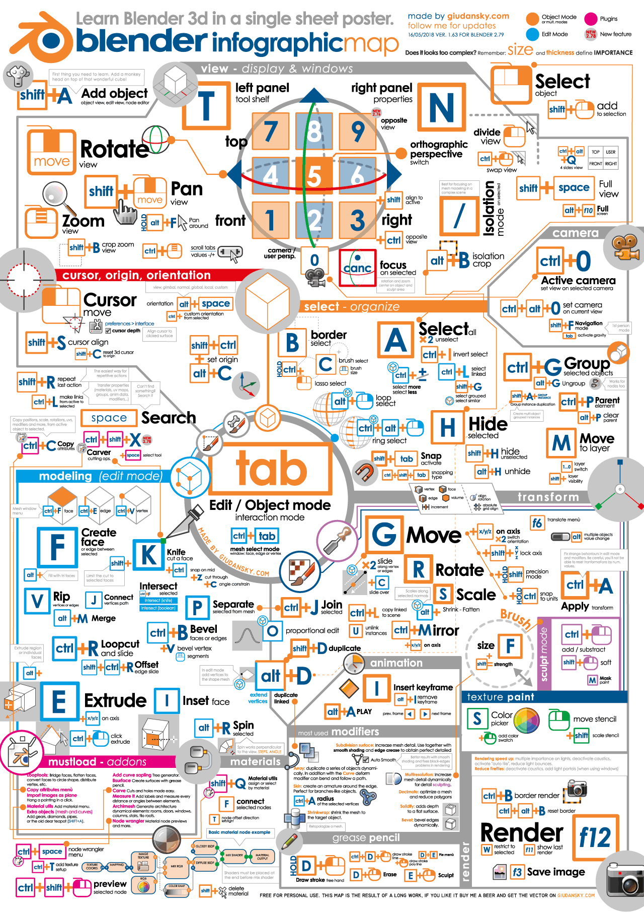

- Installation de Blender 2.8, premières utilisations.

- Apprentissage des shortcuts avec la cheatsheet suivante:

- Création d'un plan incurvé

`video: https://www.youtube.com/watch?v=clH9BftgrQE`

- Création de trou dans un objet à partir d'un autre objet

`video: https://www.youtube.com/watch?v=tkbU1bGOzWM`

- Ajout d'une épaisseur à un plan

https://blender.stackexchange.com/questions/9150/how-do-i-make-a-plane-have-thickness