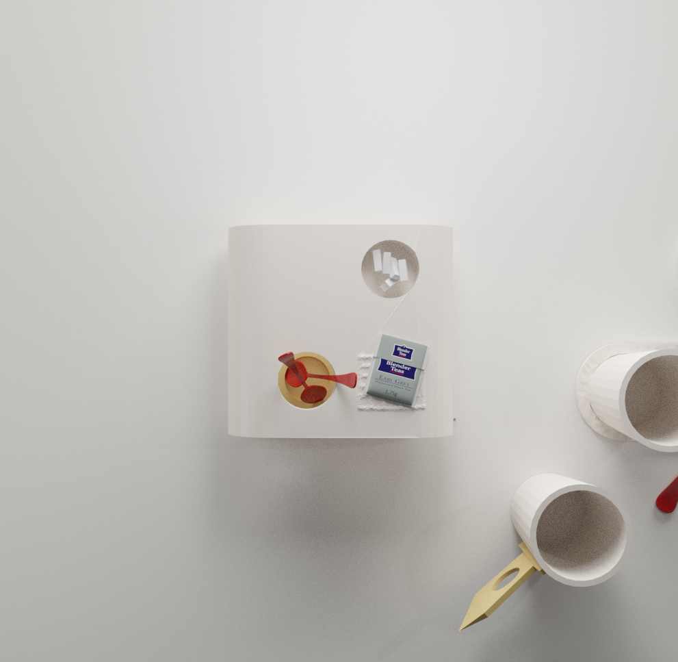

Un service de table pour le café associatif de la Tracterie.

# Workshop en partenariat avec le collectif Ne Rougissez pas!

## Les missions

1. Conception d'un contenant d'un litre minimum, destiné à contenir et servir des boissons (froides, chaudes), pouvant évantuellement être détournées pour accueillir des fleurs coupées, préparer des boissons...

2. Conception de contenants « tasse à café » (entre 10 et 15 cl) et « tasse à thé, café allongé, infusions » (entre 30 et 40cl) pouvant éventuellement être détournés pour accueillir des boissons froides.

3. Conception d'un dispositif de présentation des élements annexes: touillettes, sucres, sachets de thé, petits gâteaux,... Comment contenir, ordonner et valoriser des éléments épars ?

## Les techniques

- Tournage
- Technique des plaques
- Pinch Pot

## Les couleurs

<div style="width: 100%; height: 30px; background-color: #d83f43; display: inline-block; padding: 1rem; margin-bottom: 0rem">Rouge brique</div>
<div style="width: 100%; height: 30px; background-color: #6d90ec; display: inline-block; padding: 1rem; margin-bottom: 0rem">Bleu lavande</div>
<div style="width: 100%; height: 30px; background-color: #6cedc8; display: inline-block; padding: 1rem; margin-bottom: 2rem">Vert d'eau</div>

## Les axes de conception

Concevoir des objets:
- du quotidien (robustes, ergonomiques, ...)
- hybrides (multifonctions, à détourner, ...)
- peu encombrants (compacts, empilables, ...)
- intégrant des matériaux du collectif ou leur empreinte

## Phase 1 Le workshop
## Phase 2 La recherche
```
His work starts with digging clay by himself. When he moved to Hokkaido back in 1993, he found that naturally-occurring clay existed in a neighboring village. The clay was originally yellow sand flown from Siberia 45 thousand years ago, and was a soil of 200 million years old. 
```

`video: https://www.youtube.com/watch?v=TjmWllmhN34`
`video: https://www.youtube.com/watch?v=ktyyD78ozkM`
`video: https://www.youtube.com/watch?v=Hb4Zom9tSBc`
`video: https://www.youtube.com/watch?v=M-pC7SA6fxg`

## Phase 3 Développement et Prototypage

### Blender 2.8 Alpha

Je me suis mis à essayer la [nightly](https://builder.blender.org/download) pour modéliser les pièces pensées pour le dispositif de La Tracterie et en profiter pour apprendre Blender, logiciel de modélisation, animation et rendu 3D.




### Tutoriaux Blender

- Création d'un plan incurvé

`video: https://www.youtube.com/watch?v=clH9BftgrQE`

- Création de trou dans un objet à partir d'un autre objet

`video: https://www.youtube.com/watch?v=tkbU1bGOzWM`

- Ajout d'une épaisseur à un plan

https://blender.stackexchange.com/questions/9150/how-do-i-make-a-plane-have-thickness