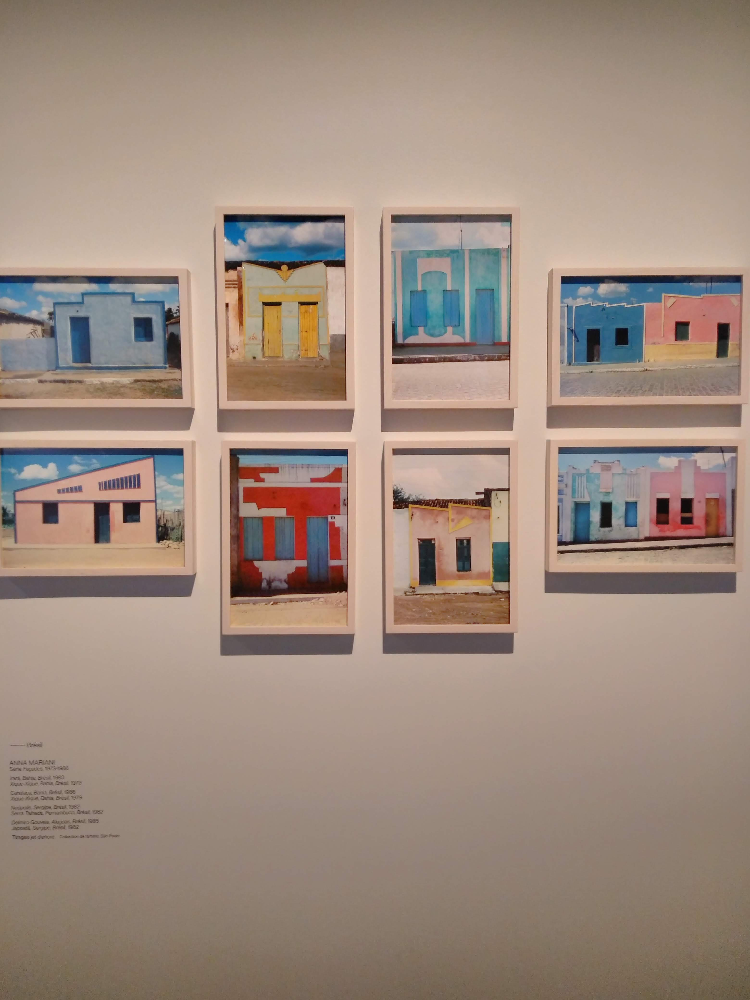
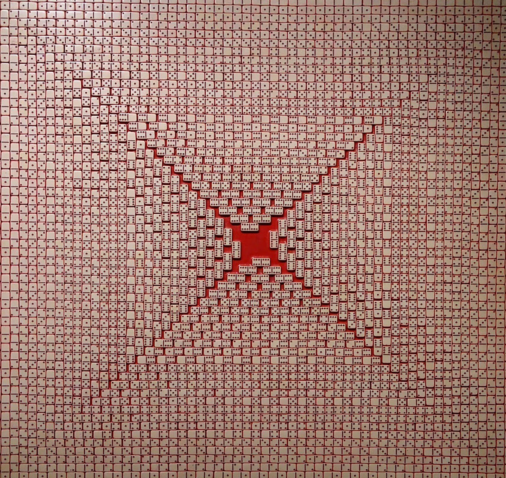

# Géométries Sud, du Mexique à la Terre de Feu

La Fondation Cartier pour l’art contemporain célèbre, avec l’exposition Géométries Sud, du Mexique à la Terre de Feu, la richesse et la variété des motifs, couleurs et figures dans l’art latino-américain. De l’art populaire à l’art abstrait, de la céramique à la peinture corporelle en passant par la sculpture, l’architecture ou la vannerie, cette exposition rassemble près de 250 œuvres de plus de 70 artistes, de la période précolombienne jusqu’aux productions les plus contemporaines. Elle explore les formes multiples de l’abstraction géométrique en Amérique latine, qu’elles trouvent leurs sources dans l’art précolombien, les avant-gardes européennes ou les cultures autochtones encore vivantes aujourd’hui. Créant des dialogues inattendus, Géométries Sud tisse des liens visuels entre les époques, les territoires et les cultures, et invite à une rêverie au cœur de ces univers.

# Gustavo Pérez
“Entièrement dévoué à son œuvre, Gustavo Pérez poursuit une ligne directrice initiée lors de sa rencontre avec la terre et le tour en 1971. Au fil des années, un créateur s’est affirmé, qui a défini un style unique – but de tout artiste – mais qui ne s’en satisfait pas et poursuit son exploration de nouvelles voies, de nouvelles aventures créatrices, de nouveaux risques techniques et esthétiques. Dans son parcours d’artiste, les succès ont représenté un tournant, un nouveau point de départ, surtout pas un point d’arrivée. Gustavo Pérez se méfie de lui-même et ne fait confiance qu’à son travail. Il ne se contente pas d’utiliser la terre, il dialogue avec elle. Comme tout vrai créateur, il vit le besoin radical du mouvement permanent.” — Alfonso Colorado, Critique d’art.

# Anna Mariani

*Façades series, 1973‐86 xique‐xique, bahia, brazil, 1979 inkjet print collection of the artist © anna mariani*

# Grayson Perry: Vanité, Identité, Sexualité

La Monnaie de Paris organise la première grande monographie en France du célèbre artiste britannique Grayson Perry (né en 1960, vit à Londres). Ses œuvres en céramique, en métal, les tapisseries et les gravures sont autant de réflexions ironiques et grinçantes sur des questions universelles telles l’identité, le genre, la classe sociale, la religion et la sexualité.
